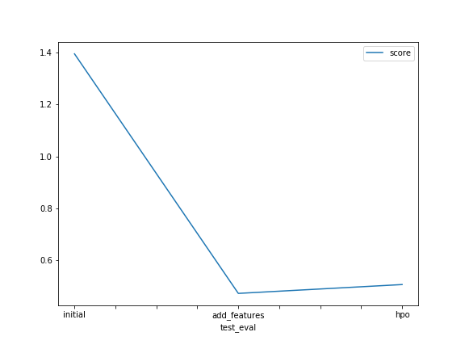

**BENAMER AMIRA RAYANE**

**Initial Training**

**What did you realize when you tried to submit your predictions? What changes were needed to the output of the predictor to submit your results?**

It does not work, since there are negative predicted values. To success the submission, it is required to put all negative values equal to 0.

**What was the top ranked model that performed?**

The first raw submission 

**Exploratory data analysis and feature creation**

**What did the exploratory analysis find and how did you add additional features?**

Categorical features are considered as numerical ones. Time also is considered as one component. Extract sub features from datetime  into day, month, year, hour.

**How much better did your model preform after adding additional features and why do you think that is?**

0.47357 

**Hyper parameter tuning**

**How much better did your model preform after trying different hyper parameters?**

0.50735 

**If you were given more time with this dataset, where do you think you would spend more time?**

EDA by analysing the correlation between features to be able to propose suitable models.

Hyper parameters phase by trying different values. 

**Create a table with the models you ran, the hyperparameters modified, and the kaggle score.**

|**Model**|**Hpo1**|**Hpo2**|**Hpo3**|**Score** |
| :- | :- | :- | :- | :- |
|**initial**|**Default-values**|**Default-values**|**Default-values**|

1.39495  
|
|**Add\_features**|**Default-values**|**Default-values**|**Default-values**|

0.47357
|
|**hpo**|
'num\_epochs': 10

'activation': ag.space.Categorical('relu', 'softrelu', 'tanh')

learning\_rate': ag.space.Real(1e-4, 1e-2, default=5e-4, log=**True**)

'layers': ag.space.Categorical([100], [1000], [200, 100], [300, 200, 100])

'dropout\_prob': ag.space.Real(0.0, 0.5, default=0.1)

'GBM': gbm\_options,

`                   `'NN': nn\_option
|
num\_trials = 5  

search\_strategy = 'auto' 

|**Default-values**|
0.50735 

|

### **Create a line plot showing the top model score for the three (or more) training runs during the project.**
### 

### **Create a line plot showing the top kaggle score for the three (or more) prediction submissions during the project.**
###

## **Summary**
It was good to try autogluon since it allows to assess the performance of different models. However, testing other models as multi-variate linear regression, Decision tree and other might also be a good choice. I

